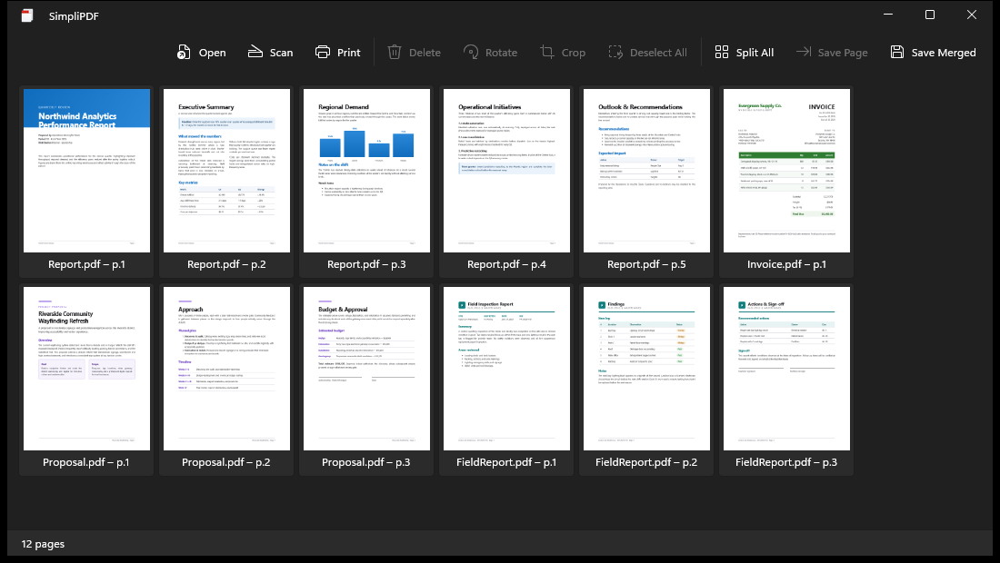

# SimpliPDF

A lightweight WinUI 3 desktop app for merging, reordering, and editing PDF pages.

## Features

- **Open & merge** multiple PDFs into one
- **Drag-and-drop** files from Windows Explorer
- **Reorder pages** by dragging thumbnails
- **Rotate** pages 90° clockwise
- **Delete** unwanted pages
- **Save Page** — save selected pages to a new PDF
- **Split All** — save every page as individual PDFs
- **Scan** — scan pages directly from a connected scanner
- **Print** the current document
- **Save Merged** — save all pages as a single PDF

## Screenshot



## Requirements

- Windows 10 (1809) or later
- .NET 10 SDK (for building from source)

## Installing

Download the latest MSI for your architecture from the
[Releases](https://github.com/alex-oswald/SimpliPDF/releases) page:

- **x64** — `SimpliPDF-<version>-x64.msi`
- **ARM64** — `SimpliPDF-<version>-arm64.msi`

Double-click the `.msi` to install. SimpliPDF installs per-user (no admin prompt)
under `%LocalAppData%\Programs\SimpliPDF` and adds a Start Menu shortcut; re-running
the installer upgrades in place. To verify a download, check it against
`SHA256SUMS.txt` with `Get-FileHash <file>.msi`.

## Building

```powershell
# Default build (ARM64 Debug)
.\build.ps1

# Release build for x64
.\build.ps1 -Architectures x64 -Configuration Release

# Self-contained native build for x64 + arm64 (runs with no install)
.\build.ps1 -Publish -Configuration Release

# Build versioned MSI installers for x64 + arm64 (output: dist\)
.\build.ps1 -Msi -Configuration Release -Version 1.2.3
```

Or open `SimpliPDF.slnx` in Visual Studio 2022+ and press F5.

### Self-contained native build

`-Publish` produces an unpackaged, self-contained build per architecture under:

```
SimpliPDF\bin\<Configuration>\net10.0-windows10.0.26100.0\win-<arch>\publish\
```

The folder bundles the Windows App SDK and the .NET runtime — or, for Native AOT targets,
compiles the runtime straight into the executable — so it runs on any Windows 10 (1809+)
machine with nothing pre-installed: just copy the folder and run `SimpliPDF.exe`. Because
WinUI 3 depends on native framework DLLs, the output is a folder (one main exe plus those
DLLs), not a single file.

> **Native AOT:** Release publishes for **x64** and **ARM64** are compiled with
> [Native AOT](https://learn.microsoft.com/dotnet/core/deploying/native-aot/) — native machine
> code with no JIT, for faster startup and a smaller footprint. **x86** publishes as a
> self-contained JIT build (Native AOT does not support x86) and **Debug** always publishes JIT.
> Building the AOT targets requires the Visual Studio **"Desktop development with C++"** workload
> (ARM64 also needs the C++ ARM64 build tools); CI builds them on `windows-latest`.

### Releasing

Releases are tag-driven. Pushing a `vMAJOR.MINOR.PATCH` tag runs
[`.github/workflows/release.yml`](.github/workflows/release.yml), which builds a
self-contained (Native AOT) MSI for x64 and ARM64 with [WiX v6](https://wixtoolset.org/),
stamps the version from the tag, and publishes a GitHub Release with the MSIs and a
`SHA256SUMS.txt`:

```powershell
git tag v1.2.3
git push origin v1.2.3
```

Prerelease tags (e.g. `v1.2.3-beta1`) publish as GitHub pre-releases. A manual
**workflow_dispatch** run builds the MSIs as artifacts without publishing a release.
The MSIs are signed with [Azure Trusted Signing](https://learn.microsoft.com/azure/trusted-signing/)
when the `AZURE_TRUSTED_SIGNING_*` repository variables (and the `release` /
`development` environments) are configured; otherwise they build unsigned.

## Tech Stack

| Component | Technology |
|-----------|-----------|
| UI Framework | WinUI 3 (Windows App SDK) |
| PDF Manipulation | [PDFsharp](https://github.com/empira/PDFsharp) (MIT) |
| Thumbnails | Windows.Data.Pdf |
| Scanning | WIA (Windows Image Acquisition) |
| Architecture | MVVM ([CommunityToolkit.Mvvm](https://github.com/CommunityToolkit/dotnet)) |
| Target | .NET 10, Windows 10+ |

## Project Structure

```
SimpliPDF.slnx                 Solution
build.ps1                      Build / publish / MSI script
installer/SimpliPDF.wxs        WiX v6 MSI installer definition
SimpliPDF/
├── Models/PdfPageItem.cs       Page model
├── ViewModels/MainViewModel.cs MVVM view model
├── Services/
│   ├── PdfService.cs           PDFsharp merge / split / rotate
│   └── ScanService.cs          WIA scanner integration
├── Dialogs/
│   └── ScanDialog.xaml/.cs     Custom scan dialog
├── Helpers/
│   ├── ThumbnailHelper.cs      PDF page → BitmapImage
│   ├── PrintHelper.cs          WinUI 3 print support
│   └── Win32FileDialog.cs      Native file dialogs (COM)
├── MainWindow.xaml / .cs       App UI & code-behind
├── App.xaml / .cs              Entry point
└── Assets/                     Icons & logos
```

## License

MIT
